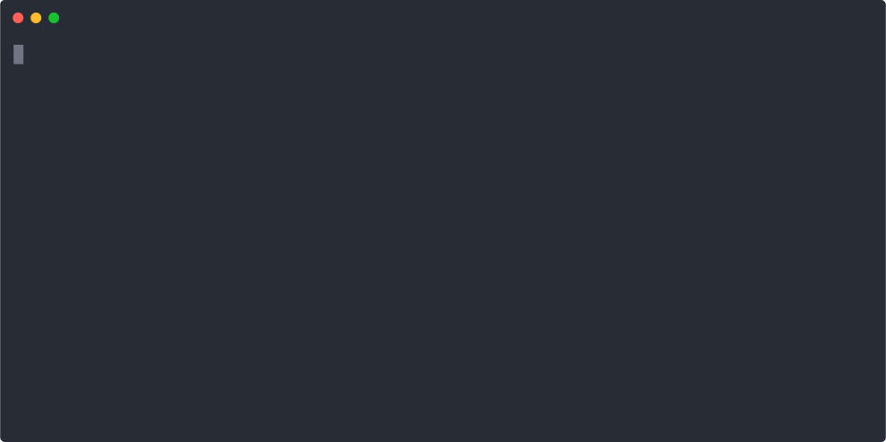

<p align="center">
  <h3 align="center">GitHub extension for CODEOWNERS Validator</h3>
  <p align="center">Ensures the correctness of your CODEOWNERS file.</p>
  <p align="center">
    <a href="/LICENSE"></a>
  </p>
</p>

The [Codeowners Validator](https://github.com/mszostok/codeowners-validator) is available as a [GitHub CLI](https://github.com/cli/cli) extension.

## Installation
```
gh extension install mszostok/gh-validate-codeowners
```

## Usage

```bash
env REPOSITORY_PATH="." \
    EXPERIMENTAL_CHECKS="notowned" \
    CHECKS="files,duppatterns,syntax" \
    gh validate-codeowners
```

<p align="center">
  
</p>

Check the [Configuration](https://github.com/mszostok/codeowners-validator#configuration) section for more info on how to enable and configure given checks.
